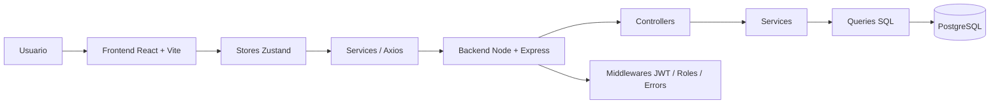

# EcoTurismo

Plataforma de ecoturismo estilo Airbnb/Booking con frontend en React + Vite y backend en Node.js + Express + PostgreSQL.

Este proyecto organiza la lógica en dos carpetas principales:

- `BACKEND/` para la API REST, autenticación, reglas de negocio y acceso a base de datos.
- `FRONTEND/` para la interfaz web, formularios, paneles por rol y consumo de la API.

## Qué cambió recientemente

El modelo dual **alojamiento + unidad** se unificó: ahora solo existe **alojamiento** como entidad reservable.

- precio, capacidad y meta (`habitaciones`, `camas`, `baños`) viven en el alojamiento
- las reservas usan `id_alojamiento`
- se eliminó el módulo `/api/unidades` y la UI de unidades
- categorías solo con `tipo: alojamiento`
- panel dinámico por rol, stores Zustand y Axios con `VITE_API_URL`

Migración de base de datos: `BACKEND/migrations/001_unidad_to_alojamiento.sql`

## Arquitectura general



### Frontend

El frontend está organizado por capas:

- `src/pages/` para pantallas principales como home, explorar y panel.
- `src/panels/` para secciones especializadas del panel por rol.
- `src/components/` para componentes reutilizables: cards, modales, formularios, galerías.
- `src/stores/` para el estado global con Zustand.
- `src/services/` para encapsular peticiones a la API.
- `src/utils/` para helpers compartidos como Axios, media y temas.

### Backend

El backend sigue una arquitectura modular:

- `src/routes/` para montar rutas.
- `src/modules/` para separar dominios: auth, usuarios, alojamientos, reservas, pagos, reseñas, categorías y moderación.- `src/middlewares/` para autenticación, autorización, validación y manejo de errores.
- `src/config/` para base de datos, Redis, Swagger y servicios externos.
- `src/services/` para integraciones auxiliares como correo, mapas y almacenamiento.
- `src/utils/` para JWT, paginación, logger y respuestas.

## Cómo funciona

### 1. Autenticación

El usuario inicia sesión o se registra desde el frontend. El backend devuelve un `token` JWT y el perfil del usuario. El frontend guarda la sesión en `localStorage` con las claves:

- `eco_token`
- `eco_user`

Después, Axios agrega el header:

```http
Authorization: Bearer <TOKEN>
```

### 2. Trabajo con stores

La UI ya no consulta la API de forma dispersa. En cambio:

- `useAuthStore` maneja login, registro y perfil.
- `useAlojamientosStore` maneja alojamientos.
- `useReservasStore` maneja reservas.
- `useUsuariosStore` maneja usuarios.
- `usePagosStore` maneja pagos.
- `useResenasStore` maneja reseñas.
- `useModeracionStore` maneja moderación.

Esto simplifica el estado, centraliza errores y hace más fácil escalar el proyecto.

### 3. Categorías

Las categorías usan `tipo: alojamiento` (el tipo `unidad` ya no existe).

### 4. Imágenes

El frontend soporta:

- selección múltiple,
- vista previa,
- eliminación antes de guardar,
- eliminación de imágenes ya subidas,
- subida con `FormData`.

Actualmente el backend ya recibe imágenes por rutas dedicadas, pero aún falta completar la integración final con Cloudinary para almacenamiento remoto estable.

## Flujo del proyecto

### Frontend

1. El usuario entra al sitio.
2. Si inicia sesión, se guarda el token y el perfil.
3. Según el rol, el panel muestra opciones distintas:
   - `turista`: explorar, reservar, reseñar.
   - `anfitrión`: gestionar alojamientos y ver reservas recibidas.   - `admin`: moderar contenido, gestionar usuarios y categorías.
4. Los formularios usan stores y services para crear/editar recursos.
5. Las imágenes y categorías se cargan según el tipo de entidad.

### Backend

1. Express recibe la petición.
2. Los middlewares validan token, rol y datos.
3. El controller delega al service.
4. El service aplica reglas de negocio.
5. Las queries interactúan con PostgreSQL.
6. Se devuelven respuestas normalizadas al frontend.


## Cómo ejecutar el proyecto

Guía completa (estructura, migraciones, `.env`, Swagger y checklist antes de subir a GitHub):

→ **[SETUP_LOCAL.md](SETUP_LOCAL.md)**

Resumen rápido:

### Backend

```bash
cd BACKEND
cp .env.example .env   # edita DB_*, JWT_SECRET, Cloudinary
npm install
npm run dev
```

Swagger: http://localhost:3000/api/docs

### Frontend

```bash
cd FRONTEND
cp .env.example .env   # VITE_API_URL=http://localhost:3000/api
npm install
npm run dev
```

## Variables de entorno

Copia las plantillas (nunca subas tus `.env` reales):

- `BACKEND/.env.example` → `BACKEND/.env`
- `FRONTEND/.env.example` → `FRONTEND/.env`

Detalle de cada variable en [SETUP_LOCAL.md](SETUP_LOCAL.md).

## API principal

Base local:

```text
http://localhost:3000/api
```

Módulos principales:

- `POST /auth/register`
- `POST /auth/login`
- `GET /usuarios`
- `GET /alojamientos`
- `GET /reservas/mine`
- `GET /pagos`
- `GET /resenas/alojamiento/:id`
- `GET /categorias?tipo=alojamiento`
- `POST /admin/moderacion/...`

## Estado actual

Lo que ya está conectado:

- login y registro con store,
- panel por rol,
- CRUD principal con stores,
- categorías filtradas por tipo,
- imágenes con preview y eliminación,
- vistas de alojamientos mejoradas.

## Pendientes y siguientes pasos

### Prioridad alta

- Ejecutar `BACKEND/migrations/001_unidad_to_alojamiento.sql` en PostgreSQL.
- Completar datos del anfitrión y políticas en el detalle (ver `Pending_backend.MD`).
- Probar creación/edición de alojamientos con imágenes y reservas con `id_alojamiento`.

### Prioridad media

- Migrar los componentes que todavía usan llamadas directas a `apiFetch`.
- Añadir pruebas más específicas para frontend y backend.

### Prioridad baja

- Mejorar paginación y filtros.
- Agregar favoritos.
- Completar experiencia social de reseñas tipo foro.
- Mejorar orden archivos css carpeta styles 
