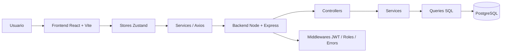

# EcoTurismo

Plataforma de ecoturismo estilo Airbnb/Booking con frontend en React + Vite y backend en Node.js + Express + PostgreSQL.

Este proyecto organiza la lógica en dos carpetas principales:

- `BACKEND/` para la API REST, autenticación, reglas de negocio y acceso a base de datos.
- `FRONTEND/` para la interfaz web, formularios, paneles por rol y consumo de la API.

## Qué cambió recientemente

Se reforzó el frontend para soportar el flujo completo de alojamiento y unidades con:

- autenticación centralizada con Zustand,
- CRUD por módulos usando stores y services,
- selección de categorías por tipo (`alojamiento` y `unidad`),
- carga múltiple de imágenes con vista previa y eliminación,
- panel dinámico por rol,
- uso de Axios con `VITE_API_URL` para conectar con la API.

En paralelo, se corrigieron problemas de importación y referencias que causaban errores como `categoriaRelations is not defined` y fallos en formularios al editar datos nulos.

## Arquitectura general



### Frontend

El frontend está organizado por capas:

- `src/pages/` para pantallas principales como home, explorar y panel.
- `src/panels/` para secciones especializadas del panel por rol.
- `src/components/` para componentes reutilizables: cards, modales, formularios, galerías.
- `src/stores/` para el estado global con Zustand.
- `src/services/` para encapsular peticiones a la API.
- `src/utils/` para helpers compartidos como Axios, media y temas.

### Backend

El backend sigue una arquitectura modular:

- `src/routes/` para montar rutas.
- `src/modules/` para separar dominios: auth, usuarios, alojamientos, unidades, reservas, pagos, reseñas, categorías y moderación.
- `src/middlewares/` para autenticación, autorización, validación y manejo de errores.
- `src/config/` para base de datos, Redis, Swagger y servicios externos.
- `src/services/` para integraciones auxiliares como correo, mapas y almacenamiento.
- `src/utils/` para JWT, paginación, logger y respuestas.

## Cómo funciona

### 1. Autenticación

El usuario inicia sesión o se registra desde el frontend. El backend devuelve un `token` JWT y el perfil del usuario. El frontend guarda la sesión en `localStorage` con las claves:

- `eco_token`
- `eco_user`

Después, Axios agrega el header:

```http
Authorization: Bearer <TOKEN>
```

### 2. Trabajo con stores

La UI ya no consulta la API de forma dispersa. En cambio:

- `useAuthStore` maneja login, registro y perfil.
- `useAlojamientosStore` maneja alojamientos.
- `useUnidadesStore` maneja unidades.
- `useReservasStore` maneja reservas.
- `useUsuariosStore` maneja usuarios.
- `usePagosStore` maneja pagos.
- `useResenasStore` maneja reseñas.
- `useModeracionStore` maneja moderación.

Esto simplifica el estado, centraliza errores y hace más fácil escalar el proyecto.

### 3. Categorías por tipo

Las categorías se separan por `tipo`:

- `alojamiento`
- `unidad`

Así el formulario de alojamiento solo muestra categorías de alojamientos y el de unidad solo muestra categorías de unidades.

### 4. Imágenes

El frontend soporta:

- selección múltiple,
- vista previa,
- eliminación antes de guardar,
- eliminación de imágenes ya subidas,
- subida con `FormData`.

Actualmente el backend ya recibe imágenes por rutas dedicadas, pero aún falta completar la integración final con Cloudinary para almacenamiento remoto estable.

## Flujo del proyecto

### Frontend

1. El usuario entra al sitio.
2. Si inicia sesión, se guarda el token y el perfil.
3. Según el rol, el panel muestra opciones distintas:
   - `turista`: explorar, reservar, reseñar.
   - `anfitrión`: gestionar alojamientos, unidades y ver reservas recibidas.
   - `admin`: moderar contenido, gestionar usuarios y categorías.
4. Los formularios usan stores y services para crear/editar recursos.
5. Las imágenes y categorías se cargan según el tipo de entidad.

### Backend

1. Express recibe la petición.
2. Los middlewares validan token, rol y datos.
3. El controller delega al service.
4. El service aplica reglas de negocio.
5. Las queries interactúan con PostgreSQL.
6. Se devuelven respuestas normalizadas al frontend.


## Cómo ejecutar el proyecto

### Backend

```bash
cd "C:\Users\melib\OneDrive\Documentos\proyectos jos\ECOTURISMO\BACKEND"
npm install
npm run dev
```

### Frontend

```bash
cd "C:\Users\melib\OneDrive\Documentos\proyectos jos\ECOTURISMO\FRONTEND"
npm install
npm run dev
```

## Variables de entorno

### Frontend

Archivo sugerido: `FRONTEND/.env`

```env
VITE_API_URL=http://localhost:3000/api
```

### Backend

Configura en `BACKEND/.env` las variables que use tu despliegue:

```env
PORT=3000
DATABASE_URL=...
JWT_SECRET=...
REDIS_URL=...
```

Si activas Cloudinary, agrega también sus credenciales:

```env
CLOUDINARY_CLOUD_NAME=...
CLOUDINARY_API_KEY=...
CLOUDINARY_API_SECRET=...
```

## API principal

Base local:

```text
http://localhost:3000/api
```

Módulos principales:

- `POST /auth/register`
- `POST /auth/login`
- `GET /usuarios`
- `GET /alojamientos`
- `GET /unidades/alojamiento/:id`
- `GET /reservas/mine`
- `GET /pagos`
- `GET /resenas/alojamiento/:id`
- `GET /categorias?tipo=alojamiento|unidad`
- `POST /admin/moderacion/...`

## Estado actual

Lo que ya está conectado:

- login y registro con store,
- panel por rol,
- CRUD principal con stores,
- categorías filtradas por tipo,
- imágenes con preview y eliminación,
- vistas de alojamientos y unidades mejoradas.

## Pendientes y siguientes pasos

### Prioridad alta

- Integrar Cloudinary para subir imágenes a la nube.
- Unificar definitivamente la carga de imágenes en backend y frontend con almacenamiento remoto.
- Probar todos los endpoints de creación/edición de alojamientos y unidades con imágenes.

### Prioridad media

- Migrar los componentes que todavía usan llamadas directas a `apiFetch`.
- Revisar moderación para dejar toda la lógica concentrada en stores y services.
- Añadir pruebas más específicas para frontend y backend.

### Prioridad baja

- Mejorar paginación y filtros.
- Agregar favoritos.
- Completar experiencia social de reseñas tipo foro.
